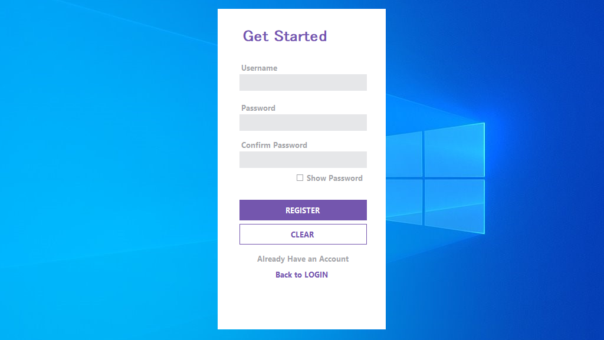
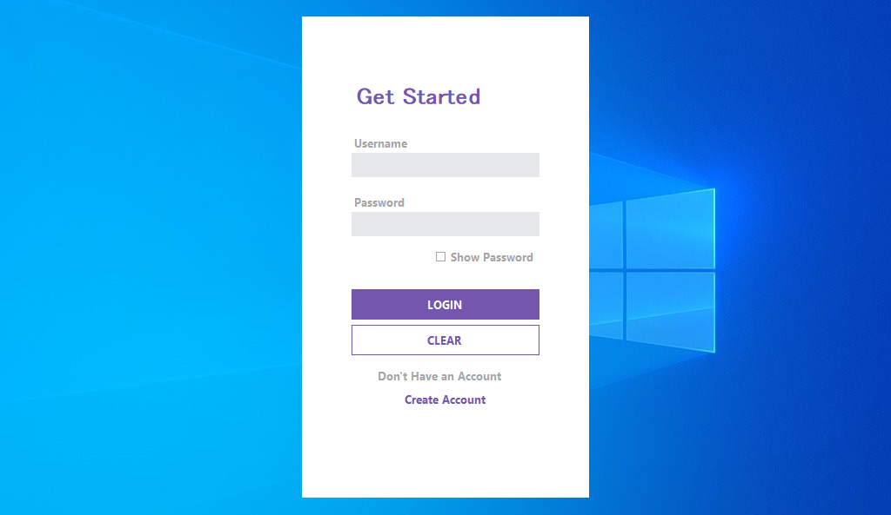

## Simple Login/Register C# Application

## Screenshots





## Getting Started

### Prerequisites

- **.NET SDK**: Make sure you have the .NET SDK installed. You can download it from [here](https://dotnet.microsoft.com/download).

### Installation

1. Clone the repository:
    ```sh
    git clone https://github.com/saveen99/RegLoginSystem.git
    cd RegLoginSystem
    ```

2. Open the project in your preferred C# IDE (e.g., Visual Studio, Visual Studio Code).

### Running the Application

1. Build the project:
    ```sh
    dotnet build
    ```

2. Run the application:
    ```sh
    dotnet run
    ```

## Contributing

Feel free to fork this repository and submit pull requests. Any contributions that improve this beginner-friendly introduction to C# are welcome!

## License

This project is licensed under the MIT License - see the [LICENSE](LICENSE) file for details.
